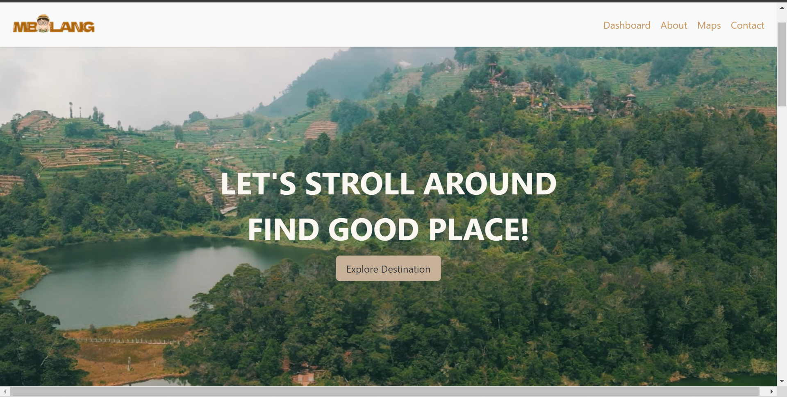
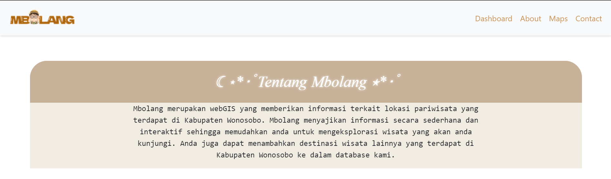
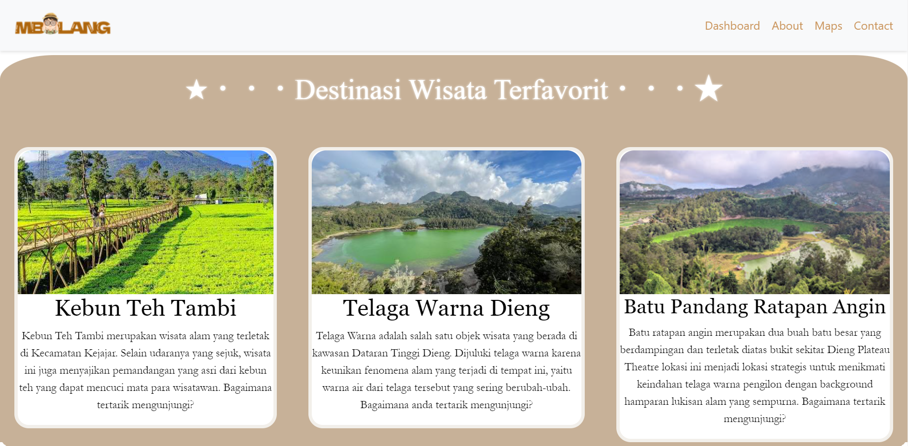
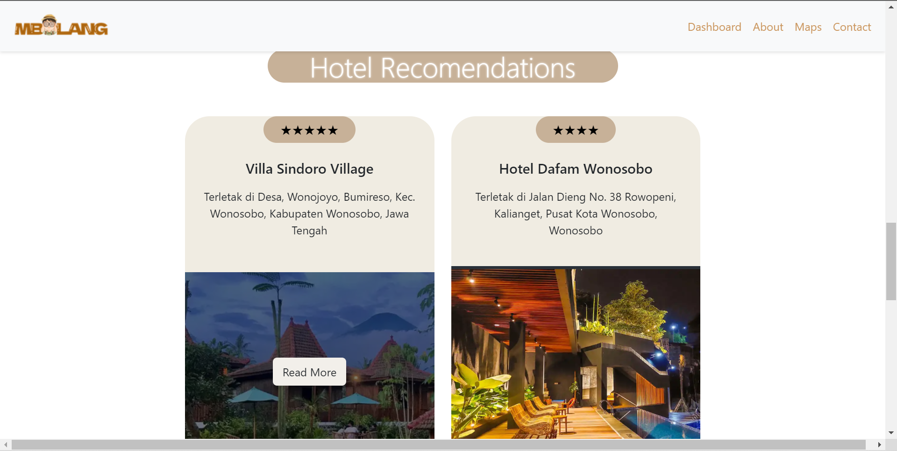
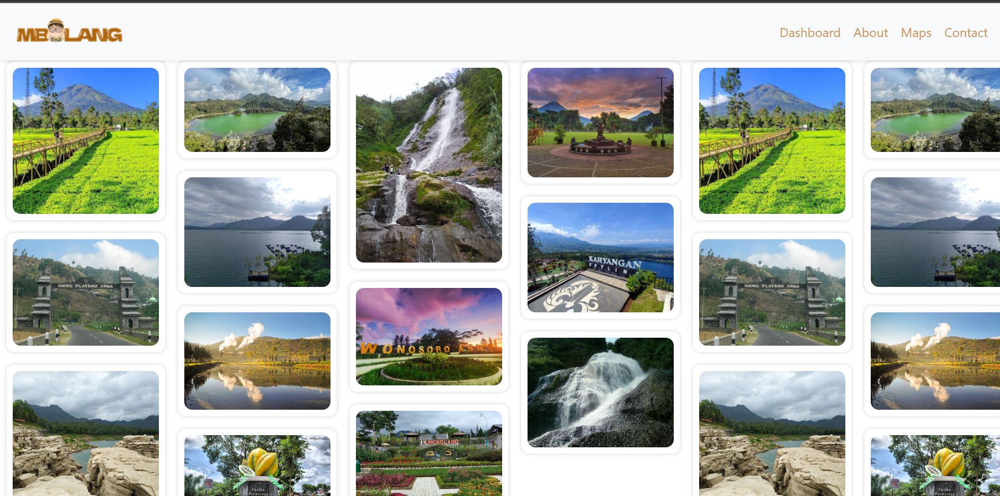
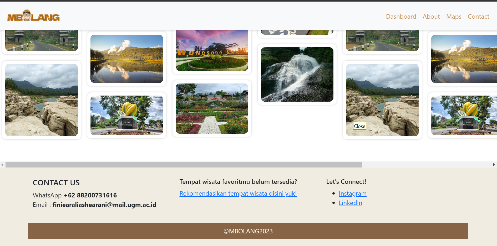
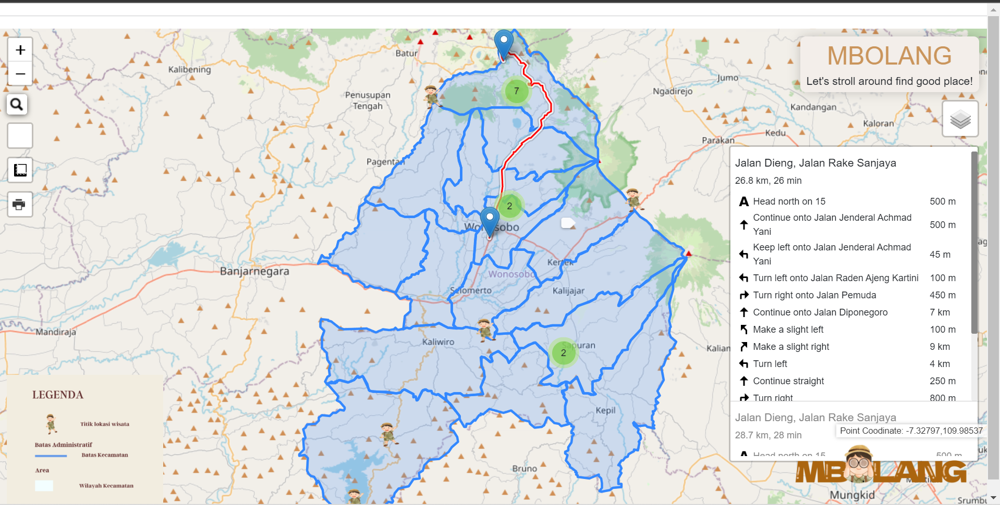
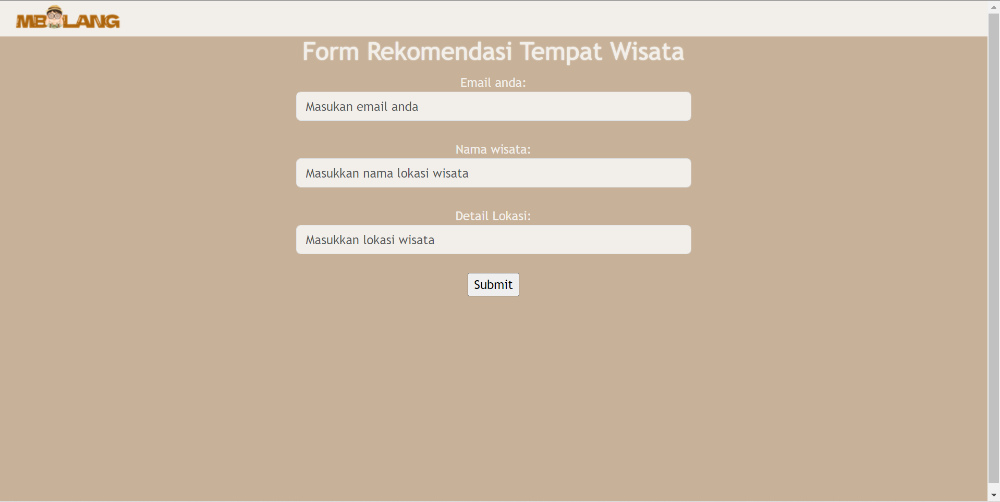

# WebGIS-Mbolang
>Produk WebGIS Responsi Praktikum Pemrograman Geospasial Web 

>**Mbolang**

>Mbolang merupakan webGIS yang menyediakan informasi terkait persebaran fasilitas pariwisata dan juga rekomendasi penginapan di Kabupaten Wonosobo. "Mbolang" merupakan padanan kata dari "bolang" yang berarti bocah petualang sehingga tujuan dibuatnya webGIS Mbolang ini untuk memudahkan wisatawan yang akan berpetualang atau berwisata di Kabupaten Wonosobo. 

>**Komponen Pembangun Produk**
1. **Bootstrap** = 
2. **Leaflet.js** =
3. **Geoserver** = 

>**Sumber data**
>1. *Titik lokasi wisata* = Google Map dan https://disparbud.wonosobokab.go.id/
>2. *Data shapefile* = Inageoportal
>2. *Gambar/Foto* =
    >- https://www.kompasiana.com/fardasannafi8722/6484956308a8b57679001112/>bahasa-jawa-ala-wonosobo-yang-unik-dan-berbeda
    >- https://www.tripadvisor.co.id/Attractions-g1137818-Activities-Wonosobo_Central_Java_Java.html
    >- https://www.wikipedieng.com/dieng/tempat-wisata-di-wonosobo/
    >- https://www.finansialku.com/wisata-wonosobo-tema-perairan/
    >- https://id.pinterest.com/pin/630292910339874201/
    >- https://www.idntimes.com/travel/destination/fajarnurmanto/
    >12-lokasi-wisata-di-wonosobo-yang-wajib-kamu-kunjungi-sekali-seumur-hidup
    >- https://atourin.com/destination/wonosobo/batu-pandang-ratapan-angin
>3. *Video* = channel youtube Raja Drone ID

>**Tangkapan Layar Komponen Produk**
>
>
>
>
>
>
>
>

